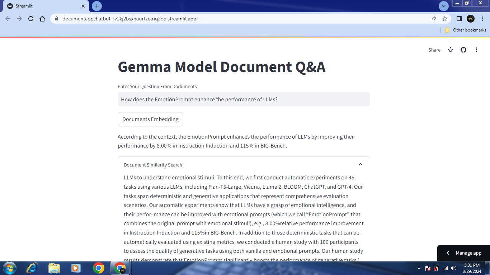

[](https://streamlit.io/)

[](https://groq.com/groundbreaking-gemma-7b-performance-running-on-the-groq-lpu-inference-engine/)
[](https://ai.google.dev/)
[](https://groq.com/)

## Project Name: **[Gemma Model Document Q&A](https://documentappchatbot-rv2kj2bsxhuurtzetnq2od.streamlit.app/)**
This repository contains the source code for the **Gemma Model Document Q&A** web application, developed and deployed using Streamlit. The app allows users to ask questions related to specific documents, and it retrieves the most relevant answers based on the context provided by the documents.

## Features ⚒️
1. **Document Ingestion**: Load and preprocess PDF documents from a specified directory.
2. **Vector Embedding**: Convert document chunks into vector embeddings using Google Generative AI Embeddings.
3. **Question Answering**: Answer user queries by retrieving relevant document chunks and generating context-based responses using the Llama3-8b-8192 model.

## Live Demo 🌐🌏

You can explore Gemma Model Document Q&A in action through live demo hosted at [https://documentappchatbot-rv2kj2bsxhuurtzetnq2od.streamlit.app/](https://documentappchatbot-rv2kj2bsxhuurtzetnq2od.streamlit.app/). Feel free to check it out.

## How to Use the Web Application
1. Open the web application using Streamlit.
2. Click on the "Documents Embedding" button to preprocess the PDF documents and store them in a vector database.
3. Enter your question in the provided text input box.
4. The application will retrieve the most relevant document sections and generate an accurate response based on the context.

## Dataset
The PDF documents used in this application are loaded from a local directory (`./Latest_Research_Paper`). Ensure that your documents are placed in this directory before running the application.

### Sample Application Workflow


## Installation
To set up the application locally, follow these steps:

1. Clone the repository:
   ```sh
   git clone https://github.com/ShifaZahra123/gemma-doc-qa.git
   ```
2. Navigate to the project directory:
   ```sh
   cd gemma-doc-qa
   ```
3. Install the required dependencies:
   ```sh
   pip install -r requirements.txt
   ```
4. Set up the environment variables:
   - Create a `.env` file in the project root directory and add your `GROQ_API_KEY` and `GOOGLE_API_KEY`.

5. Run the Streamlit application:
   ```sh
   streamlit run app.py
   ```
